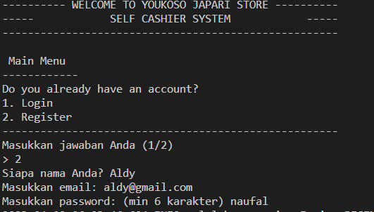
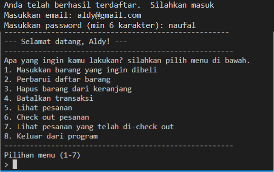
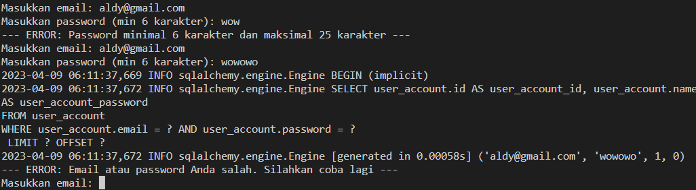
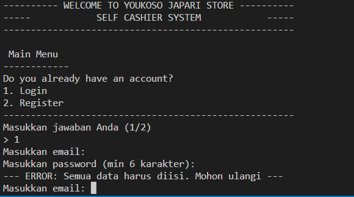
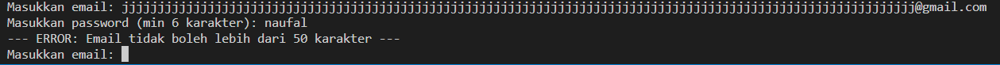
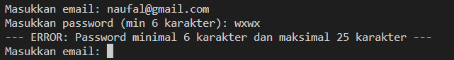

# Test Case Scenario
1. Authentication test
    - Register
        - User can register successfully
            
    - Login
        - User can login sucessfully
            

        - User failed to login, wrong email/password
            

    - Validation
        - Input is empty
            

        - E-mail address too long
            

        - Invalid e-mail
            

        - Invalid password
            
