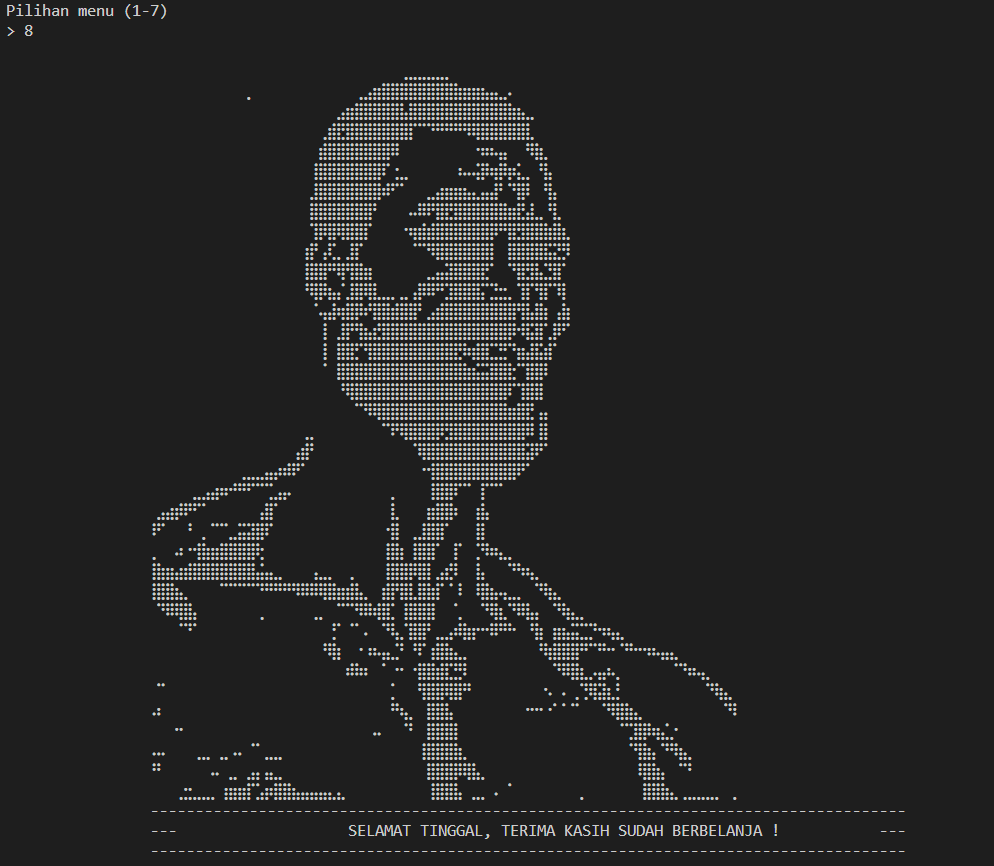

# Test Case Scenario
1. Authentication test
    - Register
        - User can register successfully

            
    - Login
        - User can login sucessfully

            

        - User failed to login, wrong email/password

            

    - Validation
        - Input is empty

            

        - E-mail address too long

            

        - Invalid e-mail

            

        - Invalid password

            

2. Transaction test
    - User could add items

        

    - User could update item
        - Only update name

            

        - Only update qty

            

        - Only update price

            

        - Update all

            

    - User could delete an item

        

    - User could reset transaction (delete entire items)

        

    - User could check item on their transaction
    
        

    - User could check out their transaction

        

    - User could see item that they have checked out
    
        

    - User could exit the program

        
